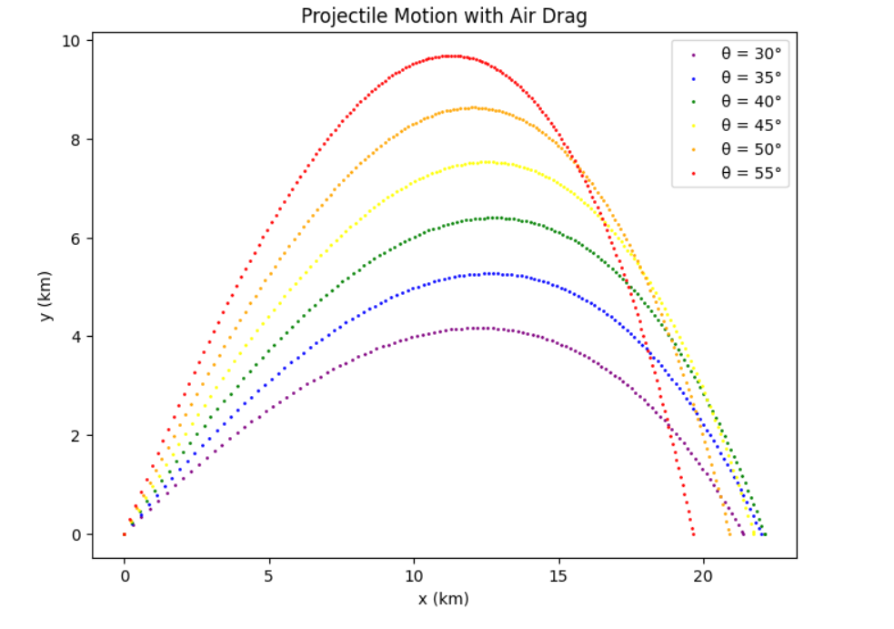

# Projectile Motion with Air Drag:

## Objective:
The program aims to replicate projectile motion with air drag. It calculates and then illustrates the trajectories for various launch angles.

## Dependencies:
1. math: This standard Python library offers a set of mathematical functions.
1. matplotlib.pyplot: A plotting library to visualize the trajectories.

## Constants and Initial Values:

- g: Acceleration due to gravity. Default is 9.81 m/s^2.
- dt: Time interval for each calculation step. Default is 0.5 seconds.
- x_start, y_start: Initial positions of the projectile. Both are set to 0 as the starting point.
- const: Quadratic drag coefficient for the air drag. Default value is 4*(10**-5) 1/m.
- v_initial: Initial launch velocity of the projectile. Default value is 700 m/s.
- angle_degree: A list of desired launch angles in degrees.
- angle: Converted list of launch angles in radians.

# Computations:

1. **Conversion of angles:**
```python
angle = [math.radians(degrees) for degrees in angle_degree]
```
Each launch angle in degrees is converted to radians.

2. **Main Trajectory Calculation Loop:**
Iterates over each launch angle to calculate the corresponding trajectory. Inside this loop:

- Initial velocity components are determined based on the launch angle.
- A nested loop calculates the trajectory until the projectile hits the ground.
- Projectile's positions are updated at each time step.
- Velocities are adjusted at each step considering gravity and air drag.
- Interpolation is performed to determine the exact landing position of the projectile.

**Looping Over Launch Angles:**
```python
for j in range(len(angle)):
```
This loop serves as a mechanism to study the trajectory of a projectile for various launch angles. By iterating over each launch angle, the code computes trajectories that help in visualizing how different angles affect the projectile's path.

**Initial Velocity Components:**
```python
vx = v_initial*math.cos(angle[j])
vy = v_initial*math.sin(angle[j])
```
Given the initial speed of the projectile and the launch angle, these lines determine the horizontal (vx) and vertical (vy) components of the velocity using trigonometric functions. Essentially, this breaks down the launch speed into how much of it pushes the projectile forward and how much lifts it upward.

**Nested Loop for Trajectory Calculation:**
```python
while y[-1]>=0:
```
This loop's condition ensures that the calculations continue as long as the projectile is above the ground (y[-1] being the latest y-position). Within this loop, we compute the projectile's path over time.

- Position Update:
```python
x.append(x[i]+vx*dt)
y.append(y[i]+vy*dt)
```
These lines update the projectile's horizontal (x) and vertical (y) positions based on their respective velocities. The dt represents the time step, which in essence is a measure of how much time we "move forward" with each iteration.

- Velocity Update (Including Air Drag):
```python
vx = vx - const*dt*vx*math.sqrt((vx**2)+(vy**2))
vy = vy - dt*(g + const*vy*math.sqrt((vx**2)+(vy**2)))
```
This part of the code updates the velocities considering two forces: gravitational acceleration and air drag. The gravitational force acts downward, which is why we subtract g from the vertical velocity vy. The air drag acts against the direction of motion and is dependent on the projectile's speed, hence the use of sqrt((vx**2)+(vy**2)) which calculates the resultant speed. The const value represents the drag coefficient.

**Interpolation for Accurate Landing Position:**
```python
r = -y[-2]/y[-1]
x[-1] = (x[-2]+r*x[-1])/(r+1)
y[-1] = 0.0
```
When the projectile is close to the ground, the time step might be too large to accurately determine the exact landing position. The lines above use linear interpolation between the last two known points to pinpoint a more accurate landing position on the x-axis.

# Visualization:
The code visualizes the trajectories using a scatter plot. Different trajectories are distinguished using unique colors. 



## Implementing pylint:

[Projectile_Motion](https://colab.research.google.com/drive/1LmtiwLG57bR6BSk1yL-Y8sUrGWs1CedB?usp=sharing)

# Projectile Motion with Air Drag - Emphasizing Functional Programming

This notebook [projectile_module](projectile_module.py) presents an implementation of the projectile motion equation while considering air resistance. The trajectories for a set of projectile angles are visualized using the `matplotlib` library. Special emphasis is placed on the functional programming aspects used in the implementation.

## Dependencies:

- `math`: Used for trigonometric calculations and other mathematical operations.
- `matplotlib.pyplot`: Essential for plotting the trajectories of the projectile.

## Core Principles of Functional Programming Used:

1. **First-Class and Higher-Order Functions**: The lambda function, a core concept in functional programming, is employed in the code to map the positions from meters to kilometers.
2. **Pure Functions**: The main function `projectile_with_drag` has no side effects, which means given the same input, it will always produce the same output. Also, it doesn't modify any state outside its scope.
3. **Immutability**: The constants like `g`, `dt`, and `const` are set and not changed throughout the code, adhering to the principle of immutability.
4. **Use of Map**: Though not directly using Python's `map` function, the application of the lambda function across a list (`x_list[i]`) is a direct reflection of the `map` functionality in functional programming.

## Function Details:

### `projectile_with_drag(v_start)`

#### Parameters:
- `v_start`: Initial velocity of the projectile (meters per second).

#### Functional Description:

1. **Lambda Functions**: The lambda function is used to convert positions from meters to kilometers for both x and y coordinates during plotting:
    ```python
    lambda z: z/1000
    ```
2. **List Comprehensions**: The code employs list comprehensions, which is a functional programming construct, to convert angles from degrees to radians:
    ```python
    angle = [math.radians(degrees) for degrees in angle_degree]
    ```

#### Outputs:

- A plot showcasing the trajectories of the projectile for each specified launch angle.

---

## Usage:

Invoke the function with a desired starting velocity to compute and visualize the projectile's trajectory:
```python
projectile_with_drag(30)

# Some useful references
[1] https://docs.python.org/3/library/math.html#math.radians
[2] https://farside.ph.utexas.edu/teaching/336k/Newton/node29.html
[3] https://docs.python.org/3/tutorial/controlflow.html#lambda-expressions


